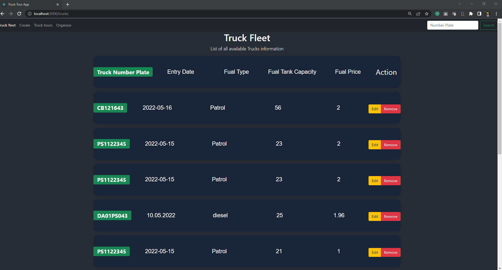

<div id="top"></div>

<!-- PROJECT LOGO -->
<br />
<div align="center">

  <h3 align="center">Truck Tour App</h3>

  <p align="center">
    The goal of this project is to create a web portal for users to take tracking on the truck's trip and their expenses. The task is given by CHI Deutschland Cargo Handling GmbH as a test project for the Full Stack Software Developer position.
  </p>
</div>


<!-- TABLE OF CONTENTS -->
<details>
  <summary>Table of Contents</summary>
  <ol>
    <li>
      <a href="#about-the-project">About The Project</a>
      <ul>
        <li><a href="#built-with">Built With</a></li>
      </ul>
    </li>
    <li>
      <a href="#getting-started">Getting Started</a>
      <ul>
        <li><a href="#prerequisites">Prerequisites</a></li>
        <li><a href="#installation">Installation</a></li>
      </ul>
    </li>
    <li><a href="#usage">Usage</a></li>
    <li><a href="#roadmap">Roadmap</a></li>
    <li><a href="#approaches">Approaches</a></li>

  </ol>
</details>


<!-- ABOUT THE PROJECT -->
## About The Project

The project is to Create a demo platform for stakeholder Jeff as a way to track tour fuel costs for the trucking fleet. The frontend is developed using React js and the backend is developed using Nest js.

### Criteria:

* There should be a page to enter a new truck which is identified by the plate number. It must have a property to enter its fuel price per liter.
* An overview page "Truck fleet" should exist to list all available trucks which are entered into the system
* A truck can be deleted from the overview page and also selected from the overview page to be edited.
* A page should exist to enter a truck tour which is identified by a unique name. It must have a property for distance in kilometers, selected truck from the truck fleet and date of tour start and end.
* An overview page "Truck tours" should exist to list all available tours which are entered into the system. This table must contain a column for the cost of every tour which is calculated by fuel price per liter * distance.
* A tour can be deleted from the overview page and also selected from the overview page to be edited.

<p align="right">(<a href="#top">back to top</a>)</p>


### Built With

This section has the list of frameworks/libraries used to bootstrap the project.

* [Nest.js](https://nestjs.com/)
* [React.js](https://reactjs.org/)
* [Bootstrap](https://getbootstrap.com)
* [MongoDB](https://www.mongodb.com/)


<p align="right">(<a href="#top">back to top</a>)</p>


<!-- GETTING STARTED -->
## Getting Started

The project is developed in javascript environment. So, to start the project nodejs environment need to be in the local machine.

### Prerequisites and Run
The app is running in two different the frontend on port 3000 and for backend port on 4000. It's possible to run the two systems separately or combinedly.  To run the system first need to go to the backend folder and the run dev.
* /backend location
  ```sh
  cd backend
  ```
* Run the app 
  ```sh
  npm run dev
  ```
Or to run the backend and frontend separately the following command need to use.
 * /backend location
  ```sh
  cd backend
  ```
  * Run the Backend 
  ```sh
  npm run server
  ```
* Run the Frontend 
  ```sh
  npm run client
  ```

<p align="right">(<a href="#top">back to top</a>)</p>


<!-- USAGE EXAMPLES -->
## Usage

In the frontend has two major features an overview page "Truck fleet" and an overview page "Truck tours". 

* Truck fleet
<div align="center">

</div>

* Truck tours

<div align="center">

</div>

For "Truck fleet" page user can input information like the Truck number plate, date of input, type of fuel, fuel capacity , and fuel price.
<div align="center">

</div>

Depending on the "Truck fleet" the user can generate the "Truck tours" with the information about the start and end date, Truck number plate, and distance and also get the cost according to the trip information..

<div align="center">

</div>

<p align="right">(<a href="#top">back to top</a>)</p>


<!-- approaches -->
## Approaches

To develop the project the following approaches that I follow.

1. Creating the backend and frontend for the intial project using nest js and racet js.
2. Developing the backend for CRUD methods.
3. Connecting the backend with database MongoDB.
4. Designing the frontend in react JS.
5. Connecting the frontend and backend.
6. Fixing the bugs and issues.
7. Add required documentations.